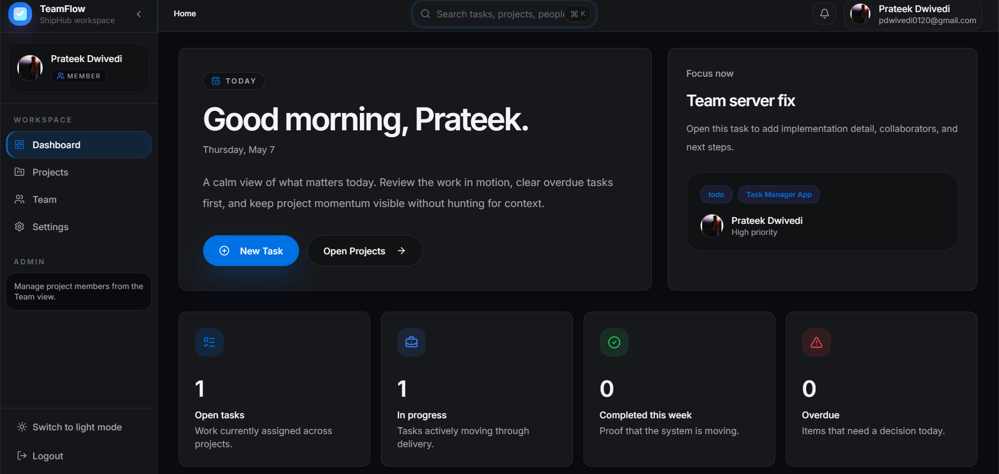
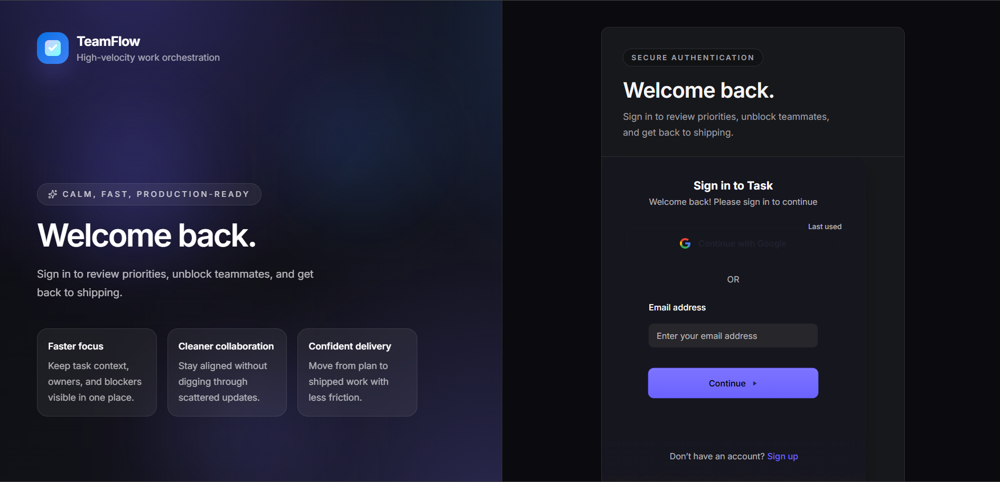
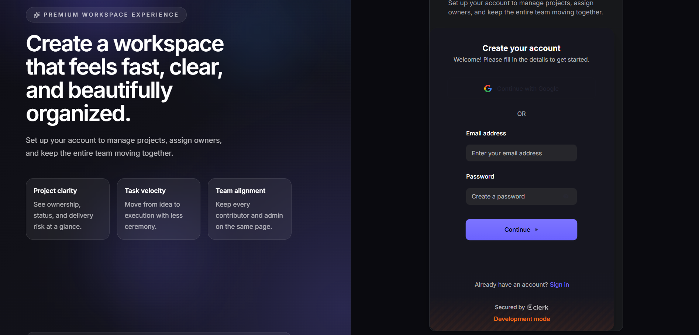
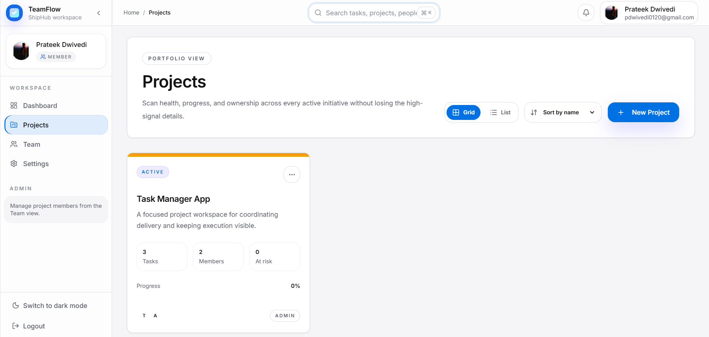
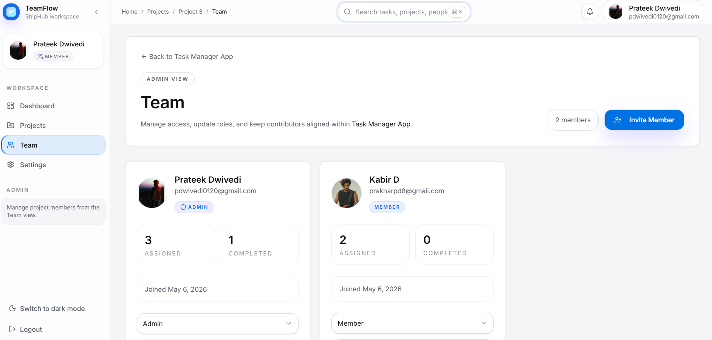
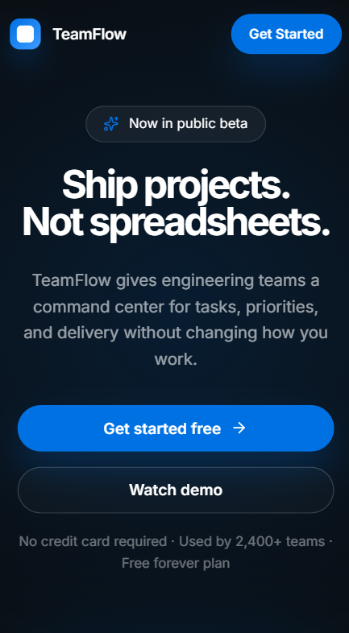

# TeamFlow - Team Task Manager

> A full-stack project and task management platform with Clerk authentication, project-scoped role controls, responsive workspace views, and a polished UI built for modern teams.



## Live Demo
**[View Live App ->](https://your-railway-app.up.railway.app)**

| Access | Details |
|------|-------|
| Authentication | Clerk-managed sign in and sign up |
| Roles | Project members can be `member` or `admin` |
| Demo access | Create an account from the signup page or use your configured Clerk test users |

---

## Screenshots

### Authentication
| Login | Signup |
|-------|--------|
|  |  |

### Dashboard


### Project Management


### Team Management


### Mobile View


---

## Features

- **Authentication** - Clerk-powered sign up, sign in, protected routes, and session-aware client state.
- **Role-Based Access** - Project-level `admin` and `member` roles with guarded team and task workflows.
- **Project Management** - Create workspaces, track progress, view status, and monitor project health from grid or list layouts.
- **Task Tracking** - Manage tasks in kanban and list views with inline creation, status filters, priority signals, and task detail pages.
- **Dashboard** - Review personal workload, recent activity, project momentum, and overdue work from a single overview screen.
- **Responsive UI** - Mobile-friendly layouts, adaptive navigation, and dedicated compact dashboard rendering.
- **Notifications** - Toast feedback for project, task, and team actions.
- **Team Management** - Invite teammates, update roles, remove members, and review participation stats per project.

---

## Tech Stack

**Frontend**
- React 19
- Vite
- Wouter
- TanStack Query
- Tailwind CSS v4
- Radix UI
- Lucide React
- Inter font

**Backend**
- Node.js
- Express 5
- REST API with zod-backed schemas and validation
- Clerk session sync for protected data access

**Database**
- PostgreSQL
- Drizzle ORM

**Deployment**
- Railway-ready Node deployment
- Static frontend build served from `dist/public`

---

## Local Setup

```bash
# Clone the repository
git clone https://github.com/prateekdz/TeamFlow.git
cd TeamFlow

# Install dependencies
npm install

# Create your environment file
cp .env.example .env
# Fill in DATABASE_URL, CLERK_PUBLISHABLE_KEY, CLERK_SECRET_KEY,
# VITE_CLERK_PUBLISHABLE_KEY, PORT, and CLIENT_PORT

# Push the database schema
npm run db:push

# Start the API server
npm start

# In a second terminal, start the frontend
npm run dev
```

Default local URLs:

- Frontend: `http://localhost:5173`
- Backend: `http://localhost:3000`

---

## Project Structure

```text
teamflow/
├── public/                 # Static assets, generated client artifacts, and README screenshots
│   └── screenshots/
├── scripts/                # Utility scripts such as screenshot capture
├── src/
│   ├── components/         # Shared UI building blocks and layout primitives
│   ├── config/             # Runtime configuration and logger setup
│   ├── controllers/        # Express route handlers
│   ├── hooks/              # Reusable React hooks
│   ├── middleware/         # Auth and proxy middleware
│   ├── models/             # API schemas and database schema definitions
│   ├── pages/              # Route-level React pages
│   ├── routes/             # Express API routes
│   └── services/           # Data and business-logic layer
├── drizzle/                # Drizzle SQL artifacts
├── index.html
├── package.json
└── README.md
```

---

## API Endpoints

| Method | Endpoint | Access | Description |
|--------|----------|--------|-------------|
| GET | `/api/healthz` | Public | Health check |
| GET | `/api/dashboard/summary` | Authenticated | Dashboard KPI summary |
| GET | `/api/dashboard/my-tasks` | Authenticated | Current user's assigned tasks |
| GET | `/api/dashboard/activity` | Authenticated | Recent task activity feed |
| GET | `/api/projects` | Authenticated | List all projects for the current user |
| POST | `/api/projects` | Authenticated | Create a new project |
| GET | `/api/projects/:projectId` | Authenticated | Fetch a single project |
| PATCH | `/api/projects/:projectId` | Authenticated | Update project metadata |
| GET | `/api/projects/:projectId/tasks` | Authenticated | List tasks for a project |
| POST | `/api/projects/:projectId/tasks` | Authenticated | Create a task in a project |
| PATCH | `/api/projects/:projectId/tasks/:taskId` | Authenticated | Update task status or fields |
| GET | `/api/projects/:projectId/members` | Authenticated | List project members |
| POST | `/api/projects/:projectId/members` | Authenticated | Invite a member to a project |
| PATCH | `/api/projects/:projectId/members/:userId` | Authenticated | Change a member role |

---

## Deployment

1. Push the repository to GitHub.
2. Create a Railway project and connect the repository.
3. Add the required environment variables:
   `DATABASE_URL`, `CLERK_PUBLISHABLE_KEY`, `CLERK_SECRET_KEY`, `VITE_CLERK_PUBLISHABLE_KEY`, `PORT`, and optional `VITE_API_BASE_URL`.
4. Use `npm run build` as the build command and `npm start` as the start command.
5. Run `npm run db:push` against the production database before first use.

**Live URL:** `https://your-railway-app.up.railway.app`

---

## Screenshot Automation

The repo includes `scripts/capture-screenshots.js` to generate the README assets automatically.

```bash
# Optional: provide an existing Clerk account for protected pages
$env:TEAMFLOW_EMAIL="your-email@example.com"
$env:TEAMFLOW_PASSWORD="your-password"

# Optional: override the frontend URL
$env:SCREENSHOT_BASE_URL="http://127.0.0.1:5173"

node scripts/capture-screenshots.js
```

If authenticated pages cannot be captured automatically, the script generates polished placeholder PNGs with the correct filenames so the README stays presentation-ready.

---

## Author

**Prateek Dwivedi**  
[GitHub](https://github.com/prateekdz)

---

Built for internship selection and portfolio review, with an emphasis on production-style UI, full-stack architecture, and team collaboration workflows.
